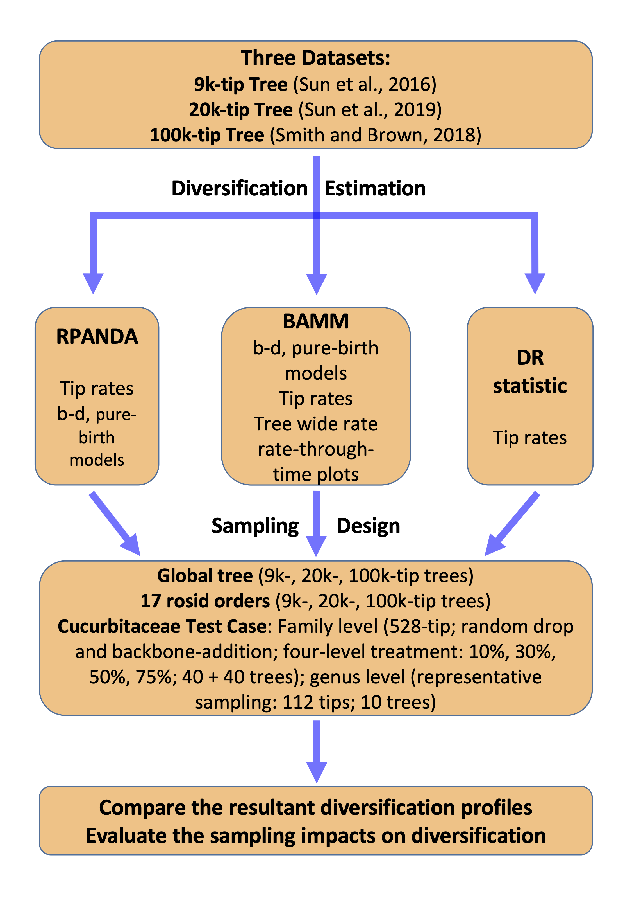

# Rosids_AJB-D-19-00298  

**Estimating rates and patterns of diversification with incomplete sampling: A case study in the rosids**  

_Miao Sun, Ryan A. Folk, Matthew A. Gitzendanner, Pamela S. Soltis1, Zhiduan Chen, Douglas E. Soltis, Robert P. Guralnick_

**_Note:_**  
_Scripts and documentation are provided here with an assumption that users have basic knowledge of UNIX shell, R, and Python, including changing the working directory, and pointing to the input and output path to link data and properly execute the scripts. In order to fully reproduce the results in our study, high performance computing clusters ([HiPerGator](https://www.rc.ufl.edu/) at University of Florida) must be used for BAMM and RPANDA analysis._  

_Here we lay out below each of our scripts based on the order of the workflow as described in the main text. All the scripts and their relative folders are descriptively named based on their primary functionalities in the analyses, and detailed under each highlighted bullet point._  

  

## Datasets

+ **trees**  
  
  This folder contains four subfolders: "rosids_9k-tip", "rosids_20k-tip", "rosids_100k-tip" and "whole_tree". See "readme" for some naming conventions, and such conventions are ture all across data and scripts in this repo.  
  As described in the main text, all analyses were run in parallel across 17 subclades corresponding to all rosid orders recognized in [APG IV (2016)](https://onlinelibrary.wiley.com/doi/10.1111/boj.12385), hence all the 17 subclades trees are inside 9k-, 20k-, and 100k-tip folders, respectively.  
  We also used the whole tree (see "whole_tree" folder) for DR and RPANDA analyses.  
  _All trees are ultrametric._  

+ **clade_age**  
  Crown age of major clades in rosids were extracted from 9k-, 20k- and 100k-tip trees, respecitvely using R script _"./Scripts/misc/get_crown_age.R"_. The age estimated from treePL is used in present study, and compared (see Fig. 2 in the main text). 

+ **diversification_data**  
  Raw data and summerized results from three commonly used methods, both parametric (RPANDA and BAMM) and semiparametric (DR). Details see below under the name of each folder.  
  
    - **RPANDA**  
    
      _A folder with all the resultant data generated by RPANDA analyses for 9k-, 20k-,and 100k-tip trees, including Rdata from birth-death and pure-birth models, summarized Akaike-weight, and diversification rates. Raw data is retained inside folders, and summarized data (`.csv` format) under directory of main folder. Any files with "17" tag means data was analyzed at subclade level, while "whole" means the whole rosid tree is analyzed._  
      
    - **BAMM**
      _Two main folders under this directory --- "BAMM_BD"" and "BAMM_PB". They contain mian results from BAMM analyses under birth-death ("BD"")_  
      
    - **DR**   
      _A folder with all the DR rates calculated by R script "./Scripts/DR/DR_statistic.R". DR rates from 17 subclades are retained in 9k, 20k, and 100k tagged folders, respectively. DR rate for the whole tree are kept in "whole_tree" folder. Mean Dr rate for eahc order are summarized in `csv` file under "DR" directory._
      
    - Cucurbitaceae_Test_Case   
      __  

## Scripts  

_**Note:** All the scripts here are categoried under the name of their directories (excuting diversification analyses, summarizing results and plotting figures in the main text, and supporting information). Please modify and confirm the input and output path before executing these scripts. All the file names here descriptively denote the specific purpose and follow the order of the main text (which see); further explanatory notes are selectively given below._  
        
+ **DR**  

    - _**DR_statistic.R**_  
        This script computes the DR statistic for the entire rosid tree and each ordinal tree. The method was described by [Jetz et al. (2012)](https://www.nature.com/articles/nature11631), and the script was derived from [Harvey et al. (2016)](https://www.pnas.org/content/114/24/6328).  
        
    - _**Extract_DR_subclade.sh**_  
        This bash script is used to extract DR rates for each order based on the species (tip) belong to which order.  It'll loop through all 17 rosid order based on [list](./Datasets/order.txt) with names of all rosid orders. All see comments inside the script.  
        
    - _**Summ_mean_DR_each_order.R**_  
        This R script will go through each of order folder created by step above, then summrized *mean* DR rates for each order.  
    
+ **RPANDA**  

    - _**fitbd.R**_  
        This script fits **9** time-dependent likelihood diversification birth-death [RPANDA models](https://besjournals.onlinelibrary.wiley.com/doi/full/10.1111/2041-210X.12526) to rosid 9k-, 20k-, and 100k-tip trees, and 17 subclades, and saving the results of fitted models as R objects.  
        outputs a summary table of parameters and values estimated from each model for each rosid subclade.  
        
    - _**fitbd_summ.R**_  
      This script outputs summary table of parameters and values estimated from each model for each rosid subclade.   
      
    - _**RPANDA_PB_model.R**_  
      This scipt will only extract pure-birth models from the 9 models mentioned above.  
      
    - _**RPANDA_summary_AW.R**_  
      This scipt reads in the summary table generated above, and then selects the model with the smallest Akaike Information Criterion (AIC; [Akaike, 1974](https://ieeexplore.ieee.org/document/1100705)) value and largest [Akaike weight](https://www.ncbi.nlm.nih.gov/pubmed/15117008) as the best diversification model for each rosid tree, or subclade, then outputs these values into a table (see **Appendix S2b**).  
          
    - _**RPANDA_model_weighted_mean_speciation_rate_summ.R**_  
          
        As explianed in the script title. Also see **Appendix S3a**.  
        
    
+ **BAMM**  
    - _**Run_priors.sh**_  
          This bash script is used for “setBAMMpriors” in BAMM analyses; combining information from `rosid_17_order_sampling_fraction.csv` and `write_prior.R`  
          
    - _**write_prior.R**_  
          This dummy script is used by `Run_priors.sh` and will output parameters for each order to feed `BAMM_diversification.config`  
          
    - _**BAMM_diversification.config**_  
            BAMM control file for diversification analyses, containing a replaceable parameter template, which would be modified by `Run_config.sh` script below for each specific order.
            
            If not converged, this file should be modified again to load event data from previous run with additional generations; for more details see [BAMM website](http://bamm-project.org/quickstart.html). 
            
    - _**Run_config.sh**_  
         This bash script will replace parameter templates (above; denoted XXX) with specific values (`rosid_17_order_sampling_fraction.csv`) corresponding to each rosid order, as well as parameters produced by `Run_priors.sh` script. After this step, the BAMM configure file is ready to run   
         
    - _**BAMM_postrun_analyses_Order_Batch.R**_   
          This script evaluate MCMC convergence of BAMM runs for each order (`Order`), and also extracts summaries of `tip rates`, `mean lambda`, `rate-through-time matrices`, etc. for downstream analyses. It also saves event data as an `.rds` file for read-in efficiency.  

+ **Cucurbitaceae_Test_Case**  
    - _**xxx.R**_  
      This script is a function sourced by `ES_SIM_Test.R`; for more details and usage see this script's author's GitHub [page](https://github.com/mgharvey/ES-sim); this script is redistributed here for convenience but users are advised to check the source repository for the most up-to-date version.
      
    - _**xxx.R**_  
        This script is a function sourced by `Fisse_test.R`; for more details, examples and usage, see [here](https://github.com/macroevolution/fisse); this script is redistributed here for convenience but users are advised to check the source repository for the most up-to-date version. 
        
    - _**xxx.R**_  
      Run script for testing trait-dependent diversification using tip rate correlations with the continuous mean annual temperature dataset  for rosid subclades and the whole tree (see **Table 1**) 
      
    - _**xxx.R**_  
      This script is used to run compared the fit of four different models: (one BiSSE-like model, one BiSSE-like null model, one HiSSE full model, and one HiSSE 2-state null model). All models and parameters are described in Table S4 (also see Supporting Information Method S3).  
      The purpose of this analysis is to test for associations between tropicality and diversification rate, and to test for potential unobserved diversification drivers.  
      
+ **Figs**  
 
    The scripts are corresponding to Figs. 2-8 in the main text. Most are barplots and diversification rate curves from BAMM.   
    
+ **misc**  

    - _**summary_datalayers_tropical_nontropical_percentage.R**_  
    This script summary species richness and distribution data, and all the temperature layers for each of 17 rosid roders (see **Table S1**).  
  
    - _**rosid_17order_tmep_trop_precentage_calc.R**_  
      This script calculates tropical and non-tropical species percentages for each of 17 rosid order (see piechart in **Fig_2**)  
      
    - _**Fig_S3.R and FigS4.BAMM_Diversification_shifts_time.R**_  
      These two script are used to generate two supplementary figures:  
        1) net diversification curves through time plot with the percentage piechart of tropical and nontropical rosid species, and paleo-temperatures curves in the background (see **Fig_S3**)  
        2) Ridge plots of the age distribution of diversification rate shift for each rosid order and boxplot shows a summary of overall ages of each diversification shift detected across all 17 orders(see **Fig_S4**).  
      
    - _**rosid_species_count_0-10_zone_vs_30-40_lat_zone.R and species_occ_tropical_nontropical_check.R**_  
      Two scripts are to used respond reviewers' questions about 1) species richness in tropical zone and temperate zone, respectively; 2) how many species has their occurance data both ranging in tropical and non-tropical zones.  
      
    
## Requirements
+ **R V.3.5.3**  
+ **Python3**  
+ **Bash** 
+ **[Newick Utilities](http://cegg.unige.ch/newick_utils)**  
  _The link with installation and mannual_  
  
  _The data analyses in this study were conducted either on a MacBook Pro laptop (OS-X) or on a Linux cluster system ([HiPerGator](https://www.rc.ufl.edu/))._  
  
  
  
_**If you found this repository useful, please cite our work and/or this repo.**_

